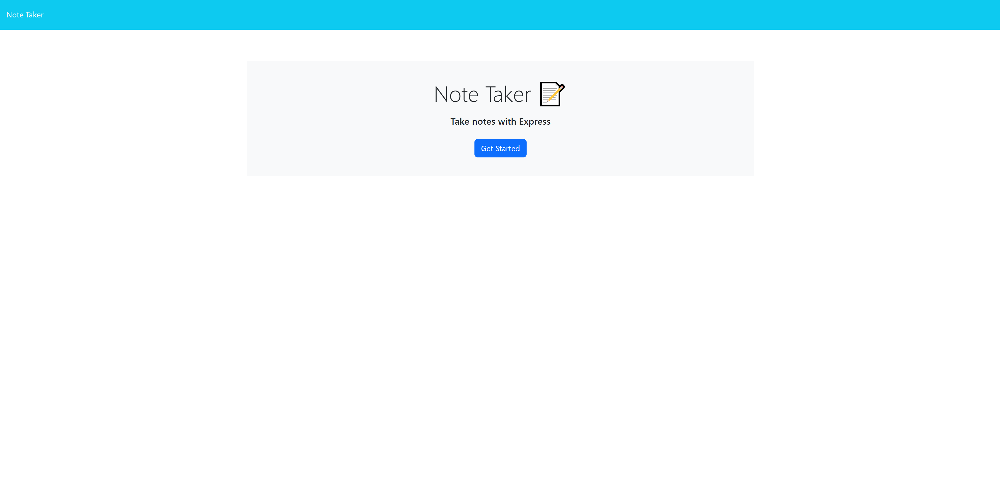

# Note-Taking-App

## Description

Provide a short description explaining the what, why, and how of your project. Use the following questions as a guide:

- What was your motivation?

    My motivation to build this website was to experiment with back end as its a new subject to me and even still confuses me slightly. I wanted to see if I could link the front end to the back end in order to make a full website.

- Why did you build this project? (Note: the answer is not "Because it was a homework assignment.")

    I built this as an example to test my skills. Back end is a new subject to me and i wanted to use backend to improve upon a previous module where you can take notes and save or deletes them for later.

- What problem does it solve?

    This solves the proiblem of linking back end and front end parts of the project together. The note app has the usefullness to take notes to have for later use as reminders of what to do. This website (hopefully by the time i finish it) is an example of what can be done when two different worlds of coding combine.

- What did you learn?

    I learned how to link two different html's together using routes as well as get, post, and delete requests in terms of backend commands. i learned how to use a db.json to store information to display on the webpage. Overall I learned how to link the front end development with the back end 


## Table of Contents (Optional)

If your README is long, add a table of contents to make it easy for users to find what they need.

- [Installation](#installation)
- [Usage](#usage)
- [Credits](#credits)
- [License](#license)

## Installation

What are the steps required to install your project? Provide a step-by-step description of how to get the development environment running.

Dependencies:

- express
- path
- fs
- uuid

## Usage

Provide instructions and examples for use. Include screenshots as needed.

To add a screenshot, create an `assets/images` folder in your repository and upload your screenshot to it. Then, using the relative filepath, add it to your README using the following syntax:




```
https://note-taking-app-module-11-be265c92c51d.herokuapp.com/
```

## Credits

List your collaborators, if any, with links to their GitHub profiles.

If you used any third-party assets that require attribution, list the creators with links to their primary web presence in this section.

If you followed tutorials, include links to those here as well.

N/A

## License

The last section of a high-quality README file is the license. This lets other developers know what they can and cannot do with your project. If you need help choosing a license, refer to [https://choosealicense.com/](https://choosealicense.com/).

---

🏆 The previous sections are the bare minimum, and your project will ultimately determine the content of this document. You might also want to consider adding the following sections.

N/A

## Badges


Badges aren't necessary, per se, but they demonstrate street cred. Badges let other developers know that you know what you're doing. Check out the badges hosted by [shields.io](https://shields.io/). You may not understand what they all represent now, but you will in time.

N/A

## Features

If your project has a lot of features, list them here.

N/A

## How to Contribute

If you created an application or package and would like other developers to contribute it, you can include guidelines for how to do so. The [Contributor Covenant](https://www.contributor-covenant.org/) is an industry standard, but you can always write your own if you'd prefer.

N/A

## Tests

Go the extra mile and write tests for your application. Then provide examples on how to run them here.

N/A